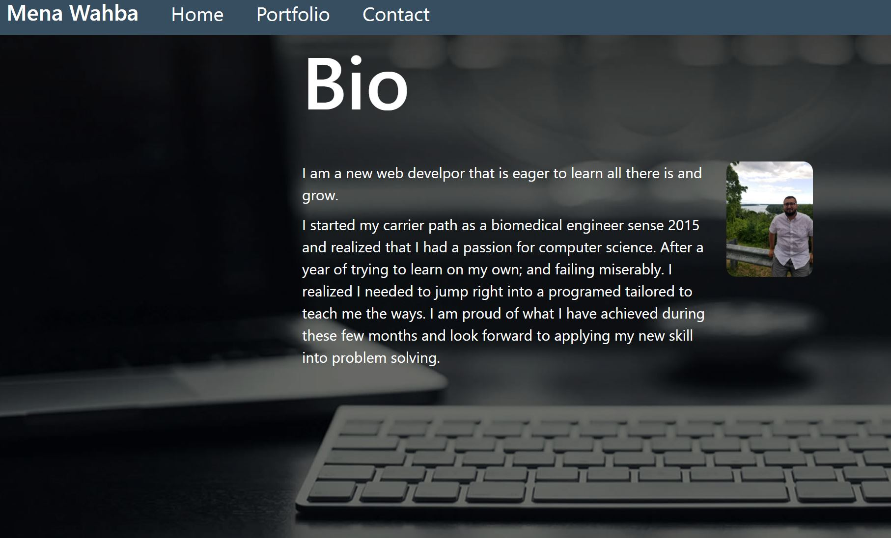

# Portfolio

## Description 

In this assignment, I updated my portfolio page. Included are some of the projects that I have worked on in order to showcase some of the skills I have aquired over the past few months. I have also included some information about myself and included my resume

---

## Installation

There should be no instillation involved. The link provided should take you straight to the webpage created on default web browser

[I am a link to the web page](https://cheetboy159.github.io/portfolio/index.html)

## Usage 

If you follow the provided link in the installation section, it will take straight to my Portfolio site. The links in the navigation section will take you to diffrent pages on the site.

## License

These files don't have a license and are there to fully share.

---
